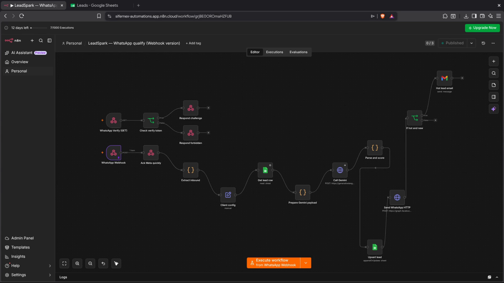

# LeadSpark

**AI lead qualification for Indian real-estate agents** — a personal project for WhatsApp and voice-driven lead scoring.

Inbound WhatsApp (or a short voice recording) becomes a scored lead in Google Sheets, with an instant reply to the buyer and a hot-lead alert to the agent.

## Demo

[](docs/media/leadspark-demo.mp4)

**[▶ Watch demo video](docs/media/leadspark-demo.mp4)** (n8n WhatsApp qualify end-to-end) · **Automation map:** [docs/AUTOMATIONS.md](docs/AUTOMATIONS.md)

---

## Why it exists

Agents lose deals while they are on site visits. Portal and Instagram enquiries sit unanswered; by the time they reply, the buyer has already spoken to several other brokers.

LeadSpark answers in seconds, asks the questions that matter (name, budget, locality, timeline, purpose, BHK), scores **hot / warm / cold**, and only pings the agent when the lead is worth a call.

---

## What’s in this repo

| Piece | Role |
|-------|------|
| **`n8n/`** | Production path — WhatsApp Cloud API + Gemini + Sheets + Gmail |
| **`n8n/voice-*`** | Voice call → transcript → structured lead |
| **Next.js app** | Pitch/demo chat UI + agent dashboard (optional) |
| **`docs/`** | End-to-end automation guide + demo video |

```
Buyer WhatsApp / Voice
        │
        ▼
   n8n + Gemini  ──▶  Google Sheets (CRM)
        │
        └── hot ──▶  Agent email (Gmail / Resend)
```

---

## Quick start

### A) n8n WhatsApp qualify (recommended)

1. Read **[n8n/SETUP.md](n8n/SETUP.md)** (accounts, Meta webhook, Sheet headers).  
2. Import `n8n/leadspark-whatsapp-qualify.json` into [n8n Cloud](https://app.n8n.cloud) (or self-host).  
3. Fill **Client config**, attach credentials, activate, connect Meta webhook.  
4. Message the Meta test number from an allowlisted phone and watch the Sheet + hot email.

### B) Voice call path

1. **[n8n/VOICE-SETUP.md](n8n/VOICE-SETUP.md)**  
2. Import `n8n/leadspark-voice-call.json`  
3. Open `n8n/voice-recorder.html` on your phone → record → Sheet tab `CallLeads`

### C) Local demo UI (no WhatsApp required)

```bash
cp .env.example .env.local
npm install
npm run dev
```

| URL | Purpose |
|-----|---------|
| http://localhost:3000 | Home |
| http://localhost:3000/demo | Pitch page + live chat |
| http://localhost:3000/chat/demo-whitefield | Widget only |
| http://localhost:3000/dashboard | Leads (`DASHBOARD_PASSWORD`) |

Works without Gemini / Supabase / Resend at first (mock AI + in-memory leads).

---

## Environment (Next.js)

| Variable | Required to pitch? | Notes |
|----------|--------------------|-------|
| `AGENT_NAME` / `AGENT_COMPANY` / `AGENT_WHATSAPP` / `AGENT_EMAIL` | Yes | Agent branding |
| `DASHBOARD_PASSWORD` | Yes | Simple dashboard login |
| `GEMINI_API_KEY` | Strongly yes for live pitch | [Google AI Studio](https://aistudio.google.com/apikey) |
| `NEXT_PUBLIC_SUPABASE_URL` + `SUPABASE_SERVICE_ROLE_KEY` | Persistence | Run `supabase/schema.sql` |
| `RESEND_API_KEY` | Hot email from the web app | Free tier OK for demos |
| `NEXT_PUBLIC_APP_URL` | Before sharing links | Your deploy URL |

Never commit `.env.local`. Use `.env.example` as the template.

---

## Deploy checklist (~5 minutes after Meta is ready)

1. Clone / redeploy (or duplicate the n8n workflow)  
2. Set agent name, company, WhatsApp, email  
3. New Google Sheet from the CSV templates — **one sheet per agent**  
4. Paste Gemini key; connect Sheets + Gmail (or Resend)  
5. Point Meta WhatsApp to the workflow Production URL  
6. Smoke-test: enquire → Sheet row → hot email  

---

## Stack

| Layer | Tools |
|-------|--------|
| Orchestration | n8n |
| Messaging | Meta WhatsApp Cloud API |
| AI | Google Gemini |
| CRM | Google Sheets |
| Alerts | Gmail (n8n) / Resend (Next.js) |
| Demo UI | Next.js 14 · TypeScript · Tailwind · Supabase (optional) |

---

## Repo layout

```
leadspark/
├── n8n/                    # Workflows, Sheet templates, setup guides
├── docs/
│   ├── AUTOMATIONS.md      # End-to-end automation reference
│   ├── demo/               # Interactive HTML demo
│   └── media/              # Demo video of n8n flow
├── src/                    # Next.js app (chat, dashboard, APIs)
└── supabase/schema.sql
```

---

## Notes

- One instance per agent (change env vars / Client config — not multi-tenant SaaS)  
- Production WhatsApp via **Cloud API only** (no unofficial QR / Baileys connectors)  

---

## License

MIT
